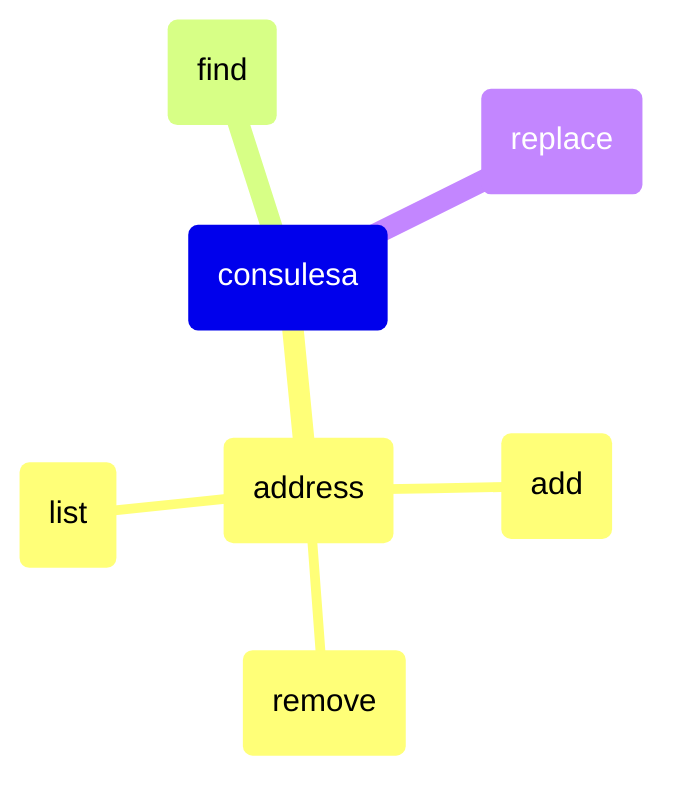

# Consulesa

An opinionated Consul CLI to do things that I guess the original Consul CLI can't do.

## Commands

### Address

Manage Consul addresses.

  

### Find

Finds keys or values recursively in Consul KV.

  

### Replace

Replaces values recursively in Consul KV.

  

## Download

Releases: https://github.com/rzcastilho/consulesa/releases
